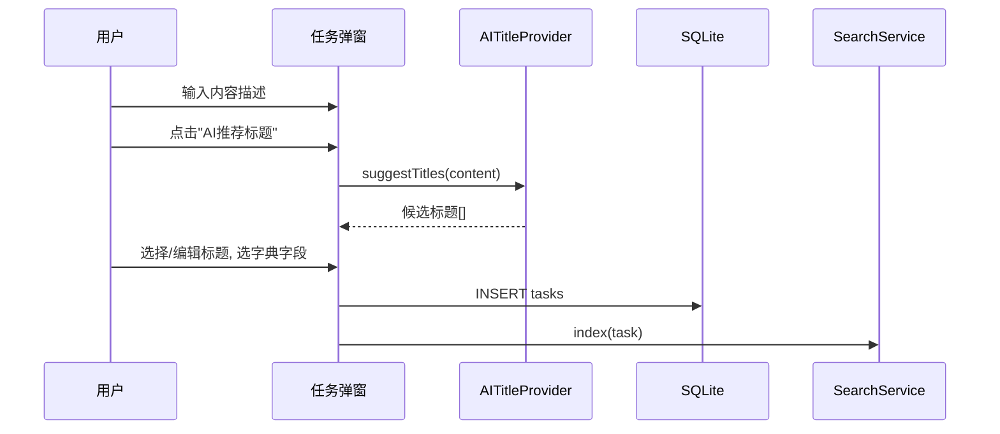
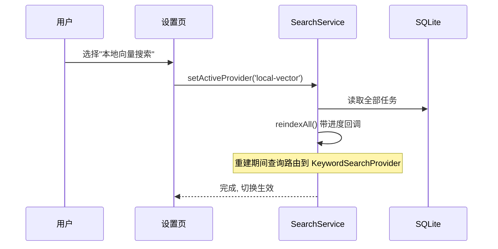

# NyaEventList 开发文档

本文档是技术实现层面的方案，对应 [设计文档](./设计文档.md) 里的产品需求。阅读顺序建议：先看设计文档理解“做什么”，再看本文档理解“怎么做”。

---

## 1. 技术选型

| 项 | 选择 | 理由 |
|---|---|---|
| 应用框架 | **Tauri v2** | 打包体积小、启动快、原生文件系统/对话框 API 完善，适合单机个人工具；比 Electron 省资源 |
| 前端 | **React 19 + TypeScript + Vite** | 生态成熟，拖拽/日历/图表库选择多 |
| 状态管理 | **Zustand** | 轻量，够用，不需要 Redux 全套模板代码 |
| 本地数据库 | **SQLite**，经 `tauri-plugin-sql`（sqlite 后端） | 单文件、支持 FTS5 全文索引、事务、足够应付千级数据量；未来要做同步也容易在 SQLite 之上加同步层 |
| 拖拽/日程交互 | 原生 **HTML5 Drag and Drop**（跨容器拖拽：任务面板→日历、看板卡片换列）+ 原生 **Pointer Events**（日历色块拉伸/挪动，需要连续的中间态坐标，原生 DnD 拿不到）+ 自研日历/时间轴组件 | 现成的日历库（如 FullCalendar）对“横向时间轴按任务分行”这种自定义视图支持有限，核心交互本来就要自己写；两种手势都是浏览器原生 API，不需要额外引入 dnd-kit 这类库 |
| 图表 | **ECharts (echarts-for-react)** | 统计模块的分布图、趋势图 |
| 本地向量模型推理 | **transformers.js**（onnxruntime-web，WASM/WebGPU） | 纯前端可跑，不需要额外起 Rust/Python 进程；模型文件运行时按需下载到应用数据目录 |
| Excel 读写 | **SheetJS (xlsx)** | 导入旧表、导出 Excel 都用它，前端 JS 直接处理 |
| AI 调用 | 前端 `fetch` 直连用户配置的 OpenAI 兼容端点 | 不引入额外 SDK 依赖，一个 `fetch` 封装即可覆盖 Chat Completions / Responses 两种格式 |
| Rust 侧职责 | 仅做 Tauri 必需的原生能力：文件系统访问、原生保存对话框、开机时初始化 SQLite 连接、API Key 的本地加密存储（`tauri-plugin-stronghold` 或系统 keychain） | 尽量把业务逻辑留在 TS 里，减少 Rust/TS 双语言维护成本 |

**为什么不是纯 Rust 后端做 AI 部分**：本地 embedding 推理、OpenAI 兼容调用在 Node/浏览器生态下库更成熟（transformers.js 有大量预转换好的 ONNX 多语言 embedding 模型可直接用），Rust 侧对应生态（candle 等）还需要自己转模型格式，维护成本更高，对个人工具没必要。

---

## 2. 项目结构

```
NyaEventList/
├─ src-tauri/                 # Rust 壳：窗口、文件系统、加密存储
│  ├─ src/
│  │  ├─ main.rs
│  │  └─ commands/            # 暴露给前端的 tauri::command（文件对话框、密钥读写等）
│  └─ tauri.conf.json
├─ src/                       # 前端主体
│  ├─ app/                    # 路由/页面壳
│  ├─ views/
│  │  ├─ log/                 # 流水录入（键盘优先的明细表，日常记录主入口，见 5.7）
│  │  ├─ schedule/            # 日程视图（纵向日历 + 横向时间轴 + 进度看板三种渲染）
│  │  ├─ tasks-panel/         # 任务面板（列表/搜索/Tab）
│  │  ├─ stats/               # 统计面板
│  │  ├─ dictionaries/        # 字典管理独立界面（系统/状态/工作内容划分/需求方类型/需求方，搜索+批量整理）
│  │  └─ settings/            # 设置页（AI 服务商、搜索模式、视图默认值等一次性配置）
│  ├─ features/
│  │  ├─ tasks/                # 任务 CRUD、引用量计算
│  │  ├─ time-entries/         # 时间记录 CRUD
│  │  ├─ option-lists/         # 字典数据与批量整理逻辑
│  │  ├─ tags/                 # 标签管理
│  │  ├─ requesters/           # 需求方（人员）管理
│  │  ├─ search/                # SearchProvider 接口与三种实现
│  │  ├─ ai-title/              # AI 标题推荐 Provider
│  │  ├─ embedding-models/      # 本地模型下载/管理
│  │  ├─ import/                # 旧 Excel 导入流水线
│  │  └─ export/                # Excel/JSON 导出
│  ├─ db/
│  │  ├─ schema.sql             # 建表脚本
│  │  ├─ migrations/            # 版本化迁移
│  │  └─ client.ts              # SQLite 访问封装
│  └─ shared/
│     └─ SelectOrCreate/        # 通用“搜索或新建”下拉组件，见 6 节
└─ docs/
   ├─ 设计文档.md
   └─ 开发文档.md
```

---

## 3. 数据库设计

设计原则：字典化的枚举字段全部走统一的 `option_lists`/`options` 表，不为每个枚举单独建表；旧表里容易对不上账的“任务描述”与“时间记录描述”拆干净，任务只存标题，明细存内容。

### 3.1 `tasks` 任务表

| 列 | 类型 | 说明 |
|---|---|---|
| id | TEXT PK (uuid) | |
| title | TEXT NOT NULL | |
| task_kind | TEXT | `requirement` \| `routine`，对应旧“需求列表”/“非需求任务列表” |
| system_option_id | TEXT FK→options | 系统，字典 `system` |
| category_option_id | TEXT FK→options | 例行工作内容划分，字典 `work_category` |
| status_option_id | TEXT FK→options | 状态，字典 `status` |
| version_no | TEXT NULL | |
| branch | TEXT NULL | |
| requirement_pool_no | TEXT NULL | |
| belongs_month | TEXT NULL | 所属月份，格式 `YYYY-MM` |
| estimated_days | REAL NULL | 预计人天 |
| planned_start | TEXT NULL | ISO 日期，开始时间 |
| target_date | TEXT NULL | ISO 日期，期望完成时间/截止日期，对应旧「需求列表」/「非需求任务列表」的结束时间；进度看板据此判断临近/超期，为空则不参与判断 |
| is_pinned | INTEGER | 0/1，是否置顶在任务面板“常用任务区”（对应旧「月日常性工作项」），当前设计为全局开关，不按月分组，见设计文档第 7 节开放问题 2 |
| legacy_code | TEXT NULL UNIQUE | 旧表编号（A01/B03…），导入去重键 |
| created_at / updated_at | TEXT | |

计算字段（不落库，查询时聚合）：`entry_count`（关联 time_entries 数，用于默认排序）、`total_hours`（累计工时）、`last_entry_at`（最近一次记录时间）、`is_scheduled`（`entry_count > 0`，用于“待安排”Tab 的过滤条件）。设计文档 39 行把“待安排”定义成纯粹的派生状态（“没有任何时间记录”），所以不单独存一列去维护同步，直接跟 `entry_count` 一样按查询实时算，避免出现“加了条时间记录但 is_scheduled 忘了同步更新”这类不一致。

### 3.2 `time_entries` 时间记录表

| 列 | 类型 | 说明 |
|---|---|---|
| id | TEXT PK | |
| task_id | TEXT FK→tasks | |
| entry_date | TEXT NOT NULL | 日期 |
| start_time | TEXT NULL | 为空表示不按精确时间记录 |
| end_time | TEXT NULL | |
| duration_hours | REAL NOT NULL | 无论是否按时间计算都要有，按时间时由起止时间算出并回写 |
| is_time_based | INTEGER | 对应旧「是否按时间计算」 |
| work_type_option_id | TEXT FK→options | 例行工作工作内容，字典 `work_type`（需求对接/功能开发/功能自测…） |
| content | TEXT | 具体内容，任务层不再重复 |
| created_at / updated_at | TEXT | |

### 3.3 `requesters` 需求方表 与 `task_requesters` 关联表

| 列 | 类型 | 说明 |
|---|---|---|
| id | TEXT PK | |
| name | TEXT NOT NULL UNIQUE | |
| requester_type_option_id | TEXT FK→options | 字典 `requester_type`，默认选项：业务方/内部协作/外部机构/其他 |
| note | TEXT NULL | |

**一个任务可以有多个需求方**（旧表“产品”列里“张三/李四”这种斜杠分隔的就是多个，导入时按 `/` 拆开，每个名字去 `requesters` 里匹配或新建），所以任务与需求方是多对多，不在 `tasks` 上放外键：

```
task_requesters(task_id FK→tasks, requester_id FK→requesters, PRIMARY KEY(task_id, requester_id))
```

从任务表单里用 6 节的 `SelectOrCreate` 直接新建一个需求方时，只传 `name`，`requester_type_option_id` 落一个预置的“其他”选项，具体类型留到字典管理页面里再补——表单里不弹二级表单，保持“先记下来，回头再归类”的轻量创建体验。`name` 上的唯一约束避免同一个人被建成两条不同记录（表单侧用同名精确匹配提示，而不是静默建重复）。

### 3.4 `option_lists` / `options` 通用字典

```
option_lists(id, key UNIQUE, label, editable)
options(
  id, list_id FK, value, label, sort_order, color NULL,
  is_done INTEGER DEFAULT 0,    -- 仅 status 字典用，标记该状态是否算完成态，驱动进度看板默认折叠列 & "未完成"Tab 口径
  UNIQUE(list_id, value)        -- 同一字典内不允许出现完全相同的值，防止手滑重复创建
)
```

`status` 字典的 `is_done` 默认值（导入/初始化时写入，后续可在字典管理页改）：`已上线`、`已终止` → `1`；`待处理`、`开发中`、`待产品交付`、`搁置中`、`已交付` → `0`。**已交付不算完成态**——交付出去不等于事情结束，后续还可能要跟反馈、修 bug，这条是确定下来的默认值，不是猜测。

预置 `key`：`system`、`work_category`、`status`、`work_type`、`requester_type`。用户可在设置页对每个 list 增删 option、拖拽排序；`editable=0` 的字典（如果以后有系统级不可编辑字典）UI 隐藏增删按钮。系统字典（`system`）保持扁平，不做父子层级——旧数据里同一系统的命名本来就不统一（比如 `JAVA-招聘系统` 和 `招聘系统（JAVA）` 实际是同一个系统），程序自动猜层级容易猜错，改用 5.5 描述的“筛选 + 批量修改”由人工决定怎么归并。

每个 option 附带一个查询时算出的“引用计数”（`SELECT COUNT(*) FROM tasks WHERE system_option_id = ?`，其他字典对应各自的外键列），字典管理页展示，用于识别哪些是常用的、哪些已经没有任务引用、可以直接删除。

### 3.5 `tags` / `task_tags` / `requester_tags` 标签

```
tags(id, name UNIQUE, color NULL)
task_tags(task_id FK, tag_id FK, PRIMARY KEY(task_id, tag_id))
requester_tags(requester_id FK, tag_id FK, PRIMARY KEY(requester_id, tag_id))
```

标签创建即用（输入不存在的名字自动建标签），设置页提供合并/重命名/删除的批量维护入口。

### 3.6 AI 与搜索相关表

```
ai_providers(
  id, name, base_url, api_key_ref,   -- api_key_ref 指向系统 keychain / stronghold 里的条目，不直接明文存 DB
  api_format,                        -- 'chat_completions' | 'responses'
  chat_model NULL,                   -- 用于标题生成
  embedding_model NULL,              -- 用于云端向量搜索，可留空
  purpose_title_enabled INTEGER,
  purpose_embedding_enabled INTEGER
)

embedding_models(               -- 本地模型管理
  id, name, repo_id, dim, quantization,
  status,                       -- 'not_downloaded' | 'downloading' | 'ready'
  local_path NULL, size_bytes NULL
)

embeddings(
  task_id FK,
  provider_key,                 -- 例如 'local:bge-small-zh' 或 'cloud:<ai_providers.id>'
  vector BLOB,                  -- Float32Array 序列化
  updated_at,
  PRIMARY KEY(task_id, provider_key)
)
```

`embeddings` 用 `(task_id, provider_key)` 联合主键而不是任务表上加一列向量，原因见设计文档 5.7：不同模型的向量空间不可比，切换 provider 要保留旧向量（万一切回去）、并触发新 provider 的全量重建，而不是覆盖。

### 3.7 全文索引

```sql
CREATE VIRTUAL TABLE tasks_fts USING fts5(title, content='tasks', content_rowid='rowid');
CREATE VIRTUAL TABLE time_entries_fts USING fts5(content, content='time_entries', content_rowid='rowid');
```
配合触发器在增删改时同步 FTS 表，支撑关键词搜索 Provider。

### 3.8 导入相关

```
import_batches(id, source_file, imported_at, sheet_mapping_json)
import_row_refs(batch_id FK, entity_type, entity_id, source_sheet, source_row)
```
记录每次导入的来源，`tasks.legacy_code` 做主去重键。**实现上的调整**：导入生成的任务 id 固定为 `legacy:<编号>`、时间记录 id 固定为 `imp:明细:<行号>`（跨午夜拆出的第二段带 `b` 后缀），来源行号已经编码在 id 里，重复导入靠 `INSERT OR IGNORE` 天然幂等，所以目前不写 `import_row_refs`（表保留，以后需要更细的追溯再用）；`import_batches` 每次导入写一行，`sheet_mapping_json` 里存各 Sheet 行数和新增数量。

### 3.9 `app_settings` 键值配置

```
app_settings(key PRIMARY KEY, value_json)
```
存视图默认（横向/纵向/看板）、面板停靠左右、当前搜索模式、进度看板“临近截止”天数阈值（`progress_board.due_soon_days`，默认 `3`）等零散配置。

---

## 4. Provider 接口设计（可插拔的核心）

### 4.1 SearchProvider

```ts
interface SearchHit { taskId: string; score: number; }

interface SearchProvider {
  readonly key: string; // 'keyword' | 'local-vector' | 'cloud-vector'
  index(task: TaskIndexable): Promise<void>;
  remove(taskId: string): Promise<void>;
  search(query: string, topK: number): Promise<SearchHit[]>;
  reindexAll(tasks: TaskIndexable[], onProgress?: (done: number, total: number) => void): Promise<void>;
}
```

- `KeywordSearchProvider`：基于 3.8 的 FTS5 表，`search` 直接跑 SQL。
- `LocalVectorSearchProvider`：依赖已下载的 `embedding_models` 记录，用 transformers.js 在渲染进程内跑推理，向量写入 `embeddings` 表，`search` 时对 query 现算向量后在 SQLite 里取全部候选做暴力余弦相似度（数据量千级，暴力足够快，不需要引入 ANN 索引）。
- `CloudVectorSearchProvider`：调用 `ai_providers` 里 `purpose_embedding_enabled=1` 的那个服务商的 embedding 接口，其余逻辑同上。

`SearchService` 持有当前激活的 Provider（由 `app_settings.search_mode` 决定），切换时调用 `reindexAll`，UI 显示进度条；重建过程中查询请求临时路由给 `KeywordSearchProvider` 兜底。

**结果排序（对应设计文档 5.2）**：`SearchService.search()` 不直接把 Provider 的 `SearchHit[]` 透传给 UI，而是先按 `taskId` 批量拉任务的 `is_done`（关联 `status` 字典的 `options.is_done`），对拿到的这 `topK` 条结果做一次分组排序：

```ts
async function search(query: string, topK: number): Promise<RankedTask[]> {
  const hits = await activeProvider.search(query, topK);
  const tasks = await loadTasksWithStatus(hits.map(h => h.taskId));
  return hits
    .map(h => ({ ...h, task: tasks[h.taskId] }))
    .sort((a, b) => {
      const groupDiff = Number(a.task.is_done) - Number(b.task.is_done); // 未完成(0) 在前
      if (groupDiff !== 0) return groupDiff;
      return b.score - a.score; // 组内按相关度
    });
}
```

`index()`/`reindexAll()` 始终覆盖全部任务（不按状态过滤），分组只影响 `SearchService` 层的排序，跟 Provider 用哪种模式无关，也不影响 Tab 筛选（Tab 是另一条独立的查询路径，直接过滤 `tasks` 表，不经过 `SearchService`）。这里按 `topK` 直接取值、不做过采样，实现简单；已知的局限是如果某个“未完成”任务的原始相关度排名刚好落在 `topK` 之外，它不会被这层重排“捞回来”排到前面——数据量小，暂时接受这个取舍，不做更复杂的分组查询。

### 4.2 AITitleProvider

```ts
interface TitleSuggestion { title: string; }

interface AITitleProvider {
  suggestTitles(content: string, context?: TaskContext): Promise<TitleSuggestion[]>;
}

class OpenAICompatibleTitleProvider implements AITitleProvider {
  constructor(private cfg: { baseUrl: string; apiKey: string; model: string; format: 'chat_completions' | 'responses' });
  async suggestTitles(content: string) {
    const body = this.cfg.format === 'chat_completions'
      ? { model: this.cfg.model, messages: [...] }
      : { model: this.cfg.model, input: [...] };
    const path = this.cfg.format === 'chat_completions' ? '/chat/completions' : '/responses';
    const res = await fetch(`${this.cfg.baseUrl}${path}`, {
      method: 'POST',
      headers: { Authorization: `Bearer ${this.cfg.apiKey}`, 'Content-Type': 'application/json' },
      body: JSON.stringify(body),
    });
    // 按 format 解析响应，抽取候选标题（prompt 要求模型以 JSON 数组返回 2-3 个候选）
  }
}
```

两种接口格式的差异只在“请求体结构”和“取响应文本的路径”上，一个 `format` 字段 + 一个 `switch` 就能覆盖，不需要为每个服务商单独写 Provider 类——只要是 OpenAI 兼容的服务（官方 OpenAI、多数国内厂商的兼容模式）都用同一个类，仅换 `baseUrl`/`model`。

### 4.3 EmbeddingModelManager

```ts
interface EmbeddingModelManager {
  listCatalog(): Promise<EmbeddingModelMeta[]>;   // 内置的可选模型清单（如 bge-small-zh, multilingual-e5-small）
  download(modelId: string, onProgress?: (pct: number) => void): Promise<void>;
  delete(modelId: string): Promise<void>;
  getLocalStatus(modelId: string): Promise<'not_downloaded' | 'downloading' | 'ready'>;
}
```
模型文件下载到 Tauri 应用数据目录（`appDataDir()/models/<modelId>/`），transformers.js 配置 `env.localModelPath` 指向该目录做离线加载；删除即删除该目录并把 `embedding_models.status` 置回 `not_downloaded`，同时清空该 provider_key 对应的 `embeddings` 记录（避免残留孤儿向量）。

---

## 5. 关键业务流程

### 5.1 新建任务 + AI 标题建议


### 5.2 切换搜索模式


### 5.3 导入旧 Excel
1. 用户选文件 → 主进程用 SheetJS 解析工作簿，列出发现的 Sheet 名。
2. 只处理 5 个固定 Sheet，其余（含「待办」）一律跳过、不提示、不落库：
   - `需求列表` → `tasks[task_kind='requirement']`
   - `非需求任务列表` → `tasks[task_kind='routine']`
   - `明细` → `time_entries`
   - `选项` → `options`（原样导入为各字典的初始选项，不做任何自动拆分/归并）
   - `月日常性工作项` → 按其中出现的旧编号匹配已导入任务，置为 `is_pinned=1`；表里两处 `#N/A` 的坏行直接跳过并在导入结果里提示
3. 展示映射预览表格（旧列名 → 新字段），允许用户手动改映射或调整。
4. 确认后批量写入（多行 `INSERT OR IGNORE`，每批不超过 900 个绑定参数）：按 `legacy_code` 查重，**已存在的任务原样保留、不覆盖**（保护你在应用里做过的修改，这一点取代了原先“已存在则更新”的设想）；同时写 `import_batches`。任务表里的“置顶”只对新导入的任务生效，不会把你取消过的置顶再打开。
5. 汇总导入结果（新增 N 条任务、M 条时间记录、跳过 K 条重复/坏行）展示给用户；如果同一系统导入后出现多个不同写法的选项，提示用户去字典管理页用 5.5 的批量修改工具整理，不在导入阶段自动处理。

### 5.4 导出
1. 用户在日程视图/统计面板圈定范围 → 前端聚合出 `ExportDTO[]`（任务标题、系统、需求方、日期、时长、内容等打平字段，列名对齐旧表习惯）。
2. 选择格式：
   - Excel：SheetJS `utils.json_to_sheet` 生成，走 Tauri 保存对话框落盘。
   - JSON：`JSON.stringify`，可选择落盘或写剪贴板（`tauri-plugin-clipboard-manager`）。

### 5.5 批量修改字段（对应设计文档 5.4）
用于整理字典重复值（如把用了 `招聘系统（JAVA）` 的任务统一改成 `JAVA-招聘系统`），也可以用来批量改需求方、状态、例行工作内容划分。

**允许批量改的字段是白名单，不是任意字段**——标题、具体内容、预计人天、开始/期望完成时间这些每条任务本来就该不一样的字段，不放进这个白名单，UI 上直接不给选：

```ts
const BULK_EDITABLE_FIELDS = [
  { field: 'system_option_id',   label: '系统',           source: { kind: 'option_list', listKey: 'system' } },
  { field: 'status_option_id',   label: '状态',           source: { kind: 'option_list', listKey: 'status' } },
  { field: 'category_option_id', label: '例行工作内容划分', source: { kind: 'option_list', listKey: 'work_category' } },
  { field: 'requesters',         label: '需求方',          source: { kind: 'requesters' }, multi: true },
] as const;

interface BulkUpdatePatch { field: typeof BULK_EDITABLE_FIELDS[number]['field']; value: string; }

// 需求方是多值字段（走 task_requesters 关联表），不能 UPDATE 一列，单独一套三种模式：
type RequesterBulkMode =
  | { mode: 'add' }                      // 追加：INSERT OR IGNORE INTO task_requesters
  | { mode: 'replace' }                  // 替换全部：先 DELETE 该批任务的所有关联，再 INSERT 新值
  | { mode: 'swap'; from: string };      // 换掉其中一个：DELETE (task, from) 后 INSERT OR IGNORE (task, to)，其余需求方不动——合并重复需求方要用这个

async function bulkUpdateTasks(taskIds: string[], patch: BulkUpdatePatch): Promise<void> {
  await db.run(`UPDATE tasks SET ${patch.field} = ? WHERE id IN (${taskIds.map(() => '?').join(',')})`, [patch.value, ...taskIds]);
  await SearchService.reindex(taskIds); // 标题/内容没变，但字典字段变了会影响筛选，增量刷新即可，不需要 reindexAll
}
```

**任务面板的“选择模式”**（`useTasksStore` 新增 `selectMode: boolean`、`selectedIds: Set<string>`）：
- 打开选择模式后，每张卡片前渲染一个 checkbox，点击切换是否在 `selectedIds` 里；面板顶部给“全选当前筛选结果”/“清空”两个快捷操作——“全选”选的是**当前筛选/搜索条件下可见的那批**，不是全库任务。
- `selectedIds.size > 0` 时面板底部浮出批量操作栏：`BULK_EDITABLE_FIELDS` 下拉选字段 → 选中后目标值用 `SelectOrCreate`（数据源按 `source` 字段切换：`system`/`status`/`work_category` 走 `option_list`，`需求方` 走 `requesters`）→ 点“应用到 N 项”调用 `bulkUpdateTasks(Array.from(selectedIds), patch)`，成功后退出选择模式、清空 `selectedIds`。

**从字典管理页发起的引导跳转**：字典管理某个选项的引用计数 > 0 时展示“筛选并批量修改”按钮，点击后：

```ts
function jumpToBulkEdit(dictTab: 'system'|'status'|'work_category'|'requesters', optionLabel: string){
  taskPanel.setSearchQuery(optionLabel);           // 复用 5.7 的全库搜索
  taskPanel.setSelectMode(true);
  taskPanel.selectAllFiltered();                    // 默认全选，用户可以再手动取消勾选一部分
  taskPanel.setBulkField(dictTab === 'requesters' ? 'requesters' : `${dictTab}_option_id`);
  if (dictTab === 'requesters') taskPanel.setRequesterBulkMode({ mode: 'swap', from: optionLabel }); // 从需求方 Tab 跳来的默认就是“把 A 换成 B”
  navigateTo('schedule');
}
```

“需求方类型”不接这套跳转——它挂在 `requesters` 实体上，量小（通常几个到十几个需求方），字典管理页「需求方」Tab 里直接编辑单个需求方的类型即可，没必要为它单独做一套批量流程。

改完之后原选项如果引用计数归零，字典管理页会显示“可删除”，用户手动确认删除。

### 5.7 流水录入（键盘优先的明细表，对应设计文档 5.6 前半）

一个 `<table>`，每行一条 `time_entries`，最后一行是永远存在的“草稿行”（不落库，`logDraft` 只在内存里，Ctrl+Enter 才写入）。列顺序对齐旧「明细」：任务 → 工作内容划分 → 具体内容 → 日期 → 开始 → 结束 → 用时（只读）。

- **格子类型**：任务、划分是 `SelectOrCreate`（任务格不开放“新建”，只能选已有任务；搜索串拼上 旧编号 + 系统 + 需求方名 + 需求/非需求，所以打 `A201`、`招聘`、`产品-甲` 都能命中）；内容、日期、开始、结束是纯文本 `<input>`，**不用 `type=time`/`type=date`**——原生控件的键盘行为不可控（不能整段敲 `930`、不能程序化地一键填值）。失焦/回车时用 `normTime`（`930`/`9:30`/`0930`/`9:30:00` → `09:30`，允许 `24:00` 作结束）和 `normDate`（`9-16`/`0916`/`2026/9/16`/带时分秒 → `YYYY-MM-DD`）规整。
- **任务状态标识**：任务格里标题右边有个小圆点（`.task-status-dot`），取当前任务的 `status`/`statusDone`（跟字典走的同一份数据，不是这条记录自己的字段）：绿色=完成态，橙色=其余状态，没有状态就不画；悬停用 `title` 显示具体状态名。目的是流水页里就能看出“正在记时间的任务，状态是不是已经被标记完成了”这种明显的疏漏，不是自动判断“该不该挪状态”的智能提示。
- **任务类型标识**：任务格标题左边是 `KindBadge`（从 5.1 任务面板那份直接 import 复用，不重写一份），需求/非需求分别是深色「需」/浅色「例」方块。用同一套字面理由：加任务时手快容易漏点「类型」那个 toggle（新建默认是「需求」），流水页平时用得最勤，一眼能扫到才容易发现选错了去改。
- **周/日视图**：顶栏的“周 / 日”切换（`view-switch`）跟日程页共用同一个组件和同一份 `scheduleView`/`dayDate` 状态（`App.tsx` 的 `WeekBar`），不是流水页自己另开一份——两边本来就共享“当前周/当前天”这个概念，切一边另一边跟着变。日视图不是另外查数据，`entries` 还是整周一起取的，只是渲染层按 `dayDate` 过滤（`LogView` 里的 `visible`），跟 `CalendarView` 日视图那个 `visible` 是一个思路。草稿默认日期、Ctrl+D 接上一行、行选择/复制这些都是照着过滤后的 `visible` 走，不是整周的 `entries`；改动/粘贴/保存草稿时如果日期落到了当前视图之外（周视图跳出这一周，日视图不等于当前这天），跳的方式也分两种：周视图 `setWeek`，日视图 `setDay`（封装成 `dateOutOfView`/`jumpToDate` 两个小函数，三处调用点共用）。
- **`SelectOrCreate` 要支持键盘**：↑/↓ 移高亮、Enter 选中高亮项（用户已经打了字或移过高亮才选，刚 Tab 进来什么都没做时 Enter 应当只是“换下一格”，否则会误选第一项）、Tab 在已输入未选时接受第一条、Esc 关菜单；带 Ctrl/Meta/Alt 的按键一律不处理，留给表格层的快捷键。
- **快捷键**（在 `<tbody>` 上做事件委托，靠 `e.target.closest('[data-field]')` 知道当前在哪一格）：Ctrl+D = `logCopyFromAbove(tr, field)`，取上一个 `.log-row` 的同一字段值写进当前格，走跟手动输入同一个 `logSetField`，所以校验、任务统计更新都一致；Ctrl+; = 当前行日期设为今天；Ctrl+Shift+;（用 `e.code === 'Semicolon'` 而不是 `e.key`，避免键盘布局差异）= 把当前时间填进当前时间格，不在时间格就填“结束”；Ctrl+Enter = 提交草稿行/或从已有行跳到草稿行；普通 Enter：草稿行换到下一格、在“结束”格提交，已有行则跳到下一行同一格；↑/↓（非下拉格）在行间同一格移动。
- **草稿行的默认值**（`newLogDraft`）：日期沿用最后一行的日期（没有记录时取今天/本周第一天），**开始时间 = 最后一行的结束时间（仅当同一天）**，划分沿用，任务/内容/结束留空。提交后 `logDraft = null` 再重渲染，光标回到草稿行任务格。日期落在当前周之外时，把 `weekStart` 切到那一周，避免“保存了但表里看不到”。
- **已有行改动**：`change` 事件里立即 `updateEntry`（按差量维护所属任务的累计工时/引用量/最近记录，跟 5.6 的编辑弹窗同一套逻辑）；结束不晚于开始时把那一格标红并在表格下方给出原因，不写入。
- **剪贴板**：监听 `copy`/`paste` 事件（不用 `navigator.clipboard`，事件里的 `clipboardData` 不需要额外权限，在 Tauri WebView 和普通浏览器里都能用）。`copy`：输入框里有选中文字时放行默认行为（复制那段文字）；否则按“已选中的行 → 当前焦点所在行”复制，格式为 `任务标题	划分	内容	日期	开始	结束`，内容里的制表符/换行替换成空格。`paste`：文本里没有制表符/换行时放行默认粘贴（就是往一个格子里粘文字）；否则按行解析，每行第一列匹配 `^[A-Za-z]{1,2}\d+$` 时按 Excel「明细」布局（编号、标题、划分、工作内容划分、内容、日期、开始、结束）解析，否则按本表布局解析；任务按 旧编号 → 标题精确 → 标题包含 的顺序匹配，匹配不上的行跳过并在 `#logMsg` 里逐行说明。焦点在草稿行且只粘一行时只带入任务/划分/内容（时间仍走“接着上一条”），其余情况每行直接生成一条记录并把 `weekStart` 切到最后一条的日期所在周。
- 行号格设 `tabindex=0`，点击后能获得焦点，这样 Ctrl+C 的事件目标才落在 `#view-log` 里面。

### 5.6 时间记录的拖拽/编辑（对应设计文档 5.6）

纵向日历里色块的三种手势，都是同一套时间-像素换算：`hour = HOUR_START + offsetY / HOUR_H`，四舍五入到 5 分钟（`Math.round(hour*12)/12`）。

```ts
type DragMode = 'create' | 'resize-top' | 'resize-bottom' | 'move';

interface DragState {
  mode: DragMode;
  entryId?: string;      // resize/move 时才有，指向已有 time_entries.id
  taskId: string;
  date: string;
  start: number; end: number; // 小时，含分钟小数
}
```

- **新建**（`mode:'create'`）：拖拽源是任务面板卡片（`dataTransfer` 带 `taskId`），落到某个日期列时创建，逻辑不变（见 4.1）。
- **拉伸**（`resize-top`/`resize-bottom`）：色块上下各留 9px 的可拖拽热区（`pointerdown` 时用 `e.target.closest('.cal-block-handle')` 判断落在哪个热区），`pointermove` 时只改 `start` 或只改 `end`，`pointerup` 时 `duration_hours = end - start`，`PATCH time_entries`。热区之外落在色块主体上触发下面的“整体挪动”。
- **整体挪动**（`move`）：`pointerdown` 记录起始偏移，`pointermove` 时 `start`/`end` 同步平移，可以跨 `day-col` 换日期（用当前指针所在列的 `data-date` 覆盖 `entry_date`）；`pointerup` 提交。
- 三种手势拖拽中都用一个浮动提示条实时显示“当前时间 · 时长”，跟原生 `dragstart/drop`（HTML5 DnD，用于新建）不同，拉伸/挪动用 `pointerdown/pointermove/pointerup` 实现，因为需要拖动过程中的连续反馈，原生 DnD 拿不到中间态坐标。
- **点击 vs 拖拽的判定要留够容错**：`pointerdown` 到 `pointerup` 之间的位移小于阈值（建议 6px，不要用接近 0 的值——真实鼠标点击很难做到零像素移动）才算“点击”触发编辑弹窗，否则按拖拽处理。这个阈值本身不保证 100% 可靠，所以色块上还固定放一个编辑图标按钮，`pointerdown` 时用 `e.target.closest('.cal-block-edit')` 提前拦截、不进入拖拽判定，直接开编辑弹窗——图标点击不吃阈值这套逻辑，是编辑功能可用性的兜底，不能省。
- **重叠布局**：同一天里有时间区间重叠的记录，渲染前先按 `date` 分组，组内做区间重叠检测（把互相重叠的记录归到同一个“重叠簇”），簇内 N 条记录各占该天列宽度的 `1/N`、左右错开排列，而不是简单地都设 `left:4px; right:4px` 叠在一起（当前实现就是这个问题，需要修）。重叠数超过一个阈值（比如 4）时不再继续按比例缩窄，改成一个“N 条重叠”的占位块，点击弹出小列表选具体是哪一条。
- **跨天保护**：编辑弹窗提交前校验 `end > start`（`entryEndInput` 解析出的小时数必须大于 `entryStartInput`），不满足时不静默处理、不强制修正，弹一条内联提示"结束时间早于开始时间，跨天的工作建议拆成两条记录"，阻止保存。不在数据模型层面支持跨天，`time_entries.entry_date` 就是唯一归属日，`start`/`end` 都是相对这一天的小时数。日历网格本身覆盖完整一天 `HOUR_START=0` 到 `HOUR_END+1=24`，默认渲染完打开后把 `canvas.scrollTop` 设到常用工作时段（比如 7 点）附近，而不是把可视范围本身砍窄——早起/熬夜的记录都落得下去，用户只是默认不用先滚过一堆空白深夜时段。
- **拖拽路径的同款提示**：`resize-bottom`/`move` 在 `pointermove` 里算出的原始值（`rawEnd`/`rawStart+dur`）一旦超过 `HOUR_END+1`，除了正常 clamp 住数值，`showDragTooltip` 的文案要切换成"已到 24:00 · 跨天请拆成两条记录"这类提示，不能让色块看起来只是悄悄停在边界上——編輯弹窗和拖拽是两条独立路径，都要触发到用户能看懂的反馈，不能一条给提示一条不给。
- **快捷录入**：
  - “现在”按钮：`onclick` 直接把 `new Date()` 格式化成 `HH:MM` 填入对应的时间输入框，不用整套时间选择器。
  - “接着记”：查询当天（或最近一天有记录的那天）`time_entries` 里 `end` 最大的一条，取它的 `end` 作为新记录的默认 `start`，弹出的还是同一个 `TimeEntryEditorProps` 编辑框，只是预填了 `start`，其余字段空着等用户填。

**编辑弹窗**（点击色块触发，非拖拽）是个独立组件，纵向日历、以及横向时间轴点格子后弹出的“当天记录列表”，共用同一个组件：

```ts
interface TimeEntryEditorProps {
  entryId: string | null;     // null = 新建
  taskId: string;
  onSave(patch: Partial<TimeEntry>): Promise<void>;
  onDelete?(): Promise<void>; // entryId 非空时才显示删除
}
```

表单字段：日期、开始/结束时间（`<input type="time">`，精确到分钟；“不按时间计算”开关勾上时换成一个总时长数字输入）、工作内容划分（`SelectOrCreate`，见 6 节）、具体内容（textarea）、所属任务（`SelectOrCreate`，允许改到别的任务，对应“记错任务”的纠错场景）。保存直接 `UPDATE`/`INSERT time_entries`，同时更新对应任务的 `entry_count`/`total_hours`/`last_entry_at`（这几个是计算字段，不需要单独维护，下次查询自动算出，这里提保存后要刷新相关卡片的展示）。

横向时间轴的格子本身只读，`onClick` 查询 `time_entries WHERE task_id=? AND entry_date=?`，条数为 1 直接开编辑弹窗，多条先弹一个小列表（复用 `.combo-menu` 类似的浮层样式），点其中一条再开编辑弹窗。

**任务级编辑跟时间记录编辑是两个不同的组件**：点任务面板卡片本体（非勾选框、非拖拽）打开的是 `TaskEditorProps`（跟 5.1「新建任务」流程里那个表单同源，字段是标题/类型/系统/例行工作内容划分/状态/需求方/预计人天/开始与期望完成时间/标签），保存走 `UPDATE tasks`；`TimeEntryEditorProps`（本节）只管某一条时间记录。两者除了都用同一套 `SelectOrCreate` 控件之外没有共享逻辑，不要为了复用把两张表单拼一起。

### 5.8 流水查询（`src/features/logQuery/LogQueryView.tsx`）

流水页（5.7）只按当前周查（`store.entries` 就是这一周的数据），没法看某个任务的全部历史，之前只能靠导出整段时间再在 Excel 里筛任务。加了一个独立的只读"查询"板块解决这个：

- **不进全局 store**：查询结果是这个组件自己的 `useState`，不写进 `store.entries`（那是流水页/日程页在用的"当前周"数据，塞进去会污染两边）。筛选直接调新加的 `repos.entries.search({ taskIds?, from?, to? })`，SQL 层按 `task_id IN (...)` / `entry_date BETWEEN` 拼 `WHERE`，吃现成的 `idx_time_entries_task`/`idx_time_entries_date` 索引。
- **筛选**：任务筛选是多选（chips + `SelectOrCreate` 搜索加入，不允许新建），不选就是全部任务；日期区间沿用统计页的预设按钮（本周/本月/自定义），多了一个"全部时间"。默认就是"全部任务 + 全部时间"，直接把匹配 SQL 结果整段查回来——本地 SQLite 一次查几千行也很快，真正的性能顾虑在渲染，所以：
- **"显示更多"分页**：查询结果全量存在内存里（用于汇总条数/工时、复制/导出全部），但只画最近 `PAGE=200` 行的 DOM，点"显示更多"往前翻。不是 SQL 层 `LIMIT/OFFSET` 分页，纯粹是渲染量控制。
- **选中 + 复制**：行选择手势（点/Ctrl 加选/Shift 区间/拖动）直接复用 `selection.ts` 里流水页同款的纯函数，选区是组件本地状态，不共用全局 `store.selection`（那个只服务流水页/日程页的删除等操作）。Ctrl+C 走单独绑的 `copy` 事件监听（只在 `screen === "logQuery"` 时接管），格式跟随设置页的"复制格式"；底部浮动工具条按钮直接调 `selection/actions.ts` 的 `copyEntries`。表格渲染跟复制/导出共用 `export/rows.ts` 的 `toExportRow`/`toExportRows`，列名和顺序对得上，不会出现"看到的"和"复制出来的"不一致。
- **只读，不支持点行编辑**：`EntryFormModal` 目前编辑时是从 `store.entries`（当前周）里 `find` 出记录的，查询页命中的历史记录大概率不在当前周里，直接复用会打开一个字段全空的编辑框。要支持"点一行改"得先把 `EntryFormModal` 改成按 id 单独查（不在 `entries` 里就 fallback 到 `repos.entries.get`），这次没做，先留着只读，要编辑就跳去流水页/日程页对应的那天改。

---

## 6. 前端模块与状态管理

- `useTasksStore`：任务列表、筛选条件、排序方式（默认：未完成 + `entry_count desc, last_entry_at desc`）、置顶任务集合（`is_pinned=1`，渲染在面板顶部“常用任务区”，不参与下方排序/筛选）、批量编辑选中集（勾选/全选当前筛选结果，供 5.5 `bulkUpdateTasks` 使用）。
- `useScheduleStore`：当前视图模式（横向/纵向/看板）、当前时间范围、选中的时间块集合（供导出用）。看板模式下额外持有“已完成态列是否展开”的开关，列的顺序/分组直接读 `status` 字典的 `sort_order`/`is_done`，不单独维护一份状态列表。
- `useSearchStore`：当前 query、当前 Provider、正在进行的重建索引进度。
- `useSettingsStore`：映射 `app_settings` 表，读写走统一的 `getSetting/setSetting`。
- `useDictionariesStore`：字典管理界面专用——当前选中的字典 Tab（`system`/`status`/`work_category`/`requester_type`/`requesters`）、搜索关键字、“⋯”菜单里的次要筛选（目前只有“只看未引用”）、每个选项的引用计数（查询时聚合，不落库）。不做重复检测，列表就是原始数据 + 引用计数，判断是否重复交给用户。

### `SelectOrCreate` 组件（对应设计文档 5.4 第 5 点）

贯穿任务表单里所有字典/实体字段的统一控件，替换掉普通 `<select>`：

```ts
interface SelectOrCreateProps<T> {
  source: { kind: 'option_list'; listKey: string } | { kind: 'requesters' };
  value: string | null;              // 选中项的 id
  onChange(id: string): void;
  onCreate?(id: string): void;       // 新建后额外回调，比如任务表单里联动别的字段
}
```

行为：输入框实时按 `label`/`name` 做子串过滤（数据量小，直接前端过滤已加载的列表，不需要额外 SQL）；列表最后一行固定是“新建『输入内容』”，除非已经存在完全同名的项（这种情况直接提示选中已有项，不允许建重复）；点“新建”即向 `options` 或 `requesters` 表插入一行并选中，字典管理页面和其他表单下次打开时读到的是同一份数据，不需要额外同步逻辑。系统字典（`system`）这类量大的字典，过滤列表超过一屏时按 `sort_order`/常用度截断显示前 N 条 + “输入更多关键字缩小范围”的提示，避免一次渲染几十个选项。

字典管理界面（`views/dictionaries/`）本质是同一份 `option_lists`/`options`/`requesters` 数据的另一种呈现：一个带搜索框、快捷筛选和引用计数的表格视图，供批量整理用；`SelectOrCreate` 是给日常录入用的轻量入口，两者共享 `features/option-lists` 和 `features/requesters` 里的同一套读写函数，不重复实现。

页面级数据全部走 SQLite 查询（不在前端维护一份内存全量副本），列表类查询做分页/虚拟滚动（`react-virtual`），因为「明细」历史数据有 6000+ 行，纵向渲染要注意性能。

---

## 7. 非功能性设计

- **API Key 安全**：不进 SQLite 明文字段，`ai_providers.api_key_ref` 只存引用 ID，真正的密钥通过 Tauri 的 `stronghold` 插件（或 Windows Credential Manager）读写，Rust 侧提供 `save_secret(ref, value)` / `read_secret(ref)` 两个 command。
- **性能**：全部数据规模是千级（参考旧表：需求列表 399 行、非需求任务列表 1997 行、明细 6267 行），SQLite + 索引足够，不需要考虑分库分表。
- **可扩展性**：字典/标签模型保证以后加分类维度不需要改表结构；`SearchProvider`/`AITitleProvider` 接口保证以后加新的 AI 服务商或搜索方式只需新增一个实现类。
- **迁移**：`db/migrations/` 按顺序编号的 SQL 文件，应用启动时检查 `PRAGMA user_version` 决定执行哪些迁移，保证后续加字段/表不需要用户手动处理。

---

## 8. 开发阶段规划

| 阶段 | 内容 | 产出 |
|---|---|---|
| Phase 0 | 项目脚手架：Tauri + React + Vite 起项目，接入 SQLite，建表脚本跑通 | 空壳应用可启动，能读写一条任务 |
| Phase 1 | 数据模型 + 导入：完成 3 节全部表，跑通旧 Excel 导入流程 | 能把你的旧表导进来，任务面板能看到列表 |
| Phase 2 | **流水录入优先**（5.7，键盘录入 + 剪贴板，是替代 Excel 明细的关键）+ 日程视图 + CRUD：纵向日历（拖拽新建、拉伸/挪动改时间、点击弹编辑框三种手势，见 5.6），任务面板筛选/排序/常用任务置顶区；任务表单里的字典/需求方字段直接用 `SelectOrCreate`（先支持选择+新建，管理能力留到 Phase 4） | 能替代“每天记录工时”这个最高频场景，且时间能精确改到分钟 |
| Phase 3 | 横向时间轴视图（只读热力图 + 点格子看当天记录列表）+ 进度看板视图 + 待安排 Tab + 拖拽排期/拖拽换状态 | 三种视图都可用 |
| Phase 4 | 关键词搜索（FTS5）+ 独立的字典管理界面（搜索、未引用筛选、引用计数、删除无引用项、状态字典 `is_done` 维护）+ 任务面板多选/批量修改字段 | 搜索可用，需求方类型/标签落地，能批量整理系统等字典重复值 |
| Phase 5 | AI 标题推荐（OpenAI 兼容 Provider）+ 设置页 Provider 配置 | AI 建标题跑通 |
| Phase 6 | 统计模块 | 统计面板可用 |
| Phase 7 | 导出（Excel/JSON） | 复制/导出功能完成 |
| Phase 8 | 本地向量搜索（模型下载管理 + transformers.js 接入）+ 云端向量搜索 | 三种搜索模式全部可切换 |
| Phase 9 | 打磨：性能（虚拟滚动）、错误处理、整库备份导出 | 可长期日常使用 |

建议 Phase 0-2 先做完就开始替换旧 Excel 的日常记录使用场景（哪怕导入/AI/统计还没做），尽早拿到真实使用反馈。

### 8.1 实现备注（Phase 0–2 已落地部分与原设计的差异）

- **数据访问层**：`src/db/types.ts` 的 `Db` 接口（`select`/`execute`）有三个适配器——Tauri SQL 插件（桌面）、sql.js（纯浏览器预览，整库存 localStorage，地址加 `?reset` 清空）、`node:sqlite`（单元测试）。**没有事务 API**：Tauri SQL 插件背后是 sqlx 连接池，跨多次调用的事务不可靠，`PRAGMA foreign_keys` 也是每连接的设置。所以：占位符只用 `?`；需要整体成败的写成单条语句；级联删除由仓库层显式完成；迁移用 `PRAGMA user_version` 且每条语句幂等，中途失败可直接重试。
- **表结构**：`task_requesters` 多了 `position`（保留需求方录入顺序）；`tasks` 多了 `description`（任务内容，导入时取需求列表的“简要内容”/非需求列表标题右边那一列，与标题相同则留空）。
- **测试**：vitest；仓库层、导入、录入表格的纯逻辑（粘贴解析、任务匹配、草稿续接）都有单测，`pnpm test`。
- **旧表导入的具体规则**（都在 `src/import/excel.ts`，有测试）：
  - “日期”列为准，“开始/结束时间”列只取时间部分（旧表里有 49 行这两列的日期部分是错的）；用时不读，由起止时间重算。
  - 结束不晚于开始的行：如果是跨午夜（用表里自己的“用时”核对得上），按午夜拆成两条并给出提示；否则跳过并列在提示里。结束恰为次日 0 点的记为 `24:00`。
  - “具体内容”里冗余的「划分：」前缀（如「功能开发：xxx」）去掉，划分单独成列。
  - 「选项」里给了工作内容划分清单时，明细里不在清单内的划分（列错位的脏数据）留空并提示，不写进字典。「待安排」不作为状态导入（它是算出来的）。
  - 非需求任务的状态有「已处理/处理中/长期」，原样进状态字典，`已处理` 记为完成态。
  - 需求方：需求列表的“产品”、非需求列表的“对接人”按 `/ 、 ， ,` 拆成多个，`无`/`？` 当作没有；名字带「（业务）」的需求方类型先归为业务方，其余默认“其他”，之后在字典管理里整理。
  - 不导入的列：绩效统计归类、各类用时列、开始/结束时间（这些在旧表里都是公式算出来的）。
- **任务面板与批量修改**：搜索/筛选/Tab 的口径在 `features/tasks/taskFilters.ts`（纯函数，有测试）；进度看板与面板共用同一份 `panel` 条件（`SearchBar`）。批量修改只开放系统/状态/划分/需求方四个字段，需求方三种模式（追加/整体替换/换掉其中一个）都是单条 SQL，超过 800 个 id 自动分批。
- **字典管理**：引用数按各字典自己的口径统计（系统/状态/划分看任务数，工作内容划分看时间记录数，需求方类型看需求方数）；重命名遇到同名会拒绝并提示走“筛选 + 批量修改”合并，删除只允许删无引用的（单条 `DELETE … WHERE NOT EXISTS`）。
- **进度看板**：列跟状态字典走，完成态列默认折叠，拖卡片换列即改状态；期望完成时间在任务表单里填，临近天数阈值存 `app_settings.dueSoonDays`（默认 3）。
- **统计与导出**：`features/stats/aggregate.ts` 在内存里按区间聚合（多需求方任务的工时平均分给各需求方，合计不会重复）；导出列名沿用旧「明细」表，支持复制为制表符文本、Excel、JSON。桌面版保存文件走 `tauri-plugin-dialog` + `tauri-plugin-fs`（浏览器预览走普通下载），对应权限在 `capabilities/default.json`。图表暂时用纯 CSS 柱条，没有引入 ECharts。
- **桌面版拖拽**：Tauri 在 Windows 上默认拦截“文件拖放”，会把网页内部的 HTML5 拖拽（任务卡拖进日历、看板换列）一起吞掉，所以 `tauri.conf.json` 里窗口要设 `dragDropEnabled: false`。代价是不能把文件直接拖进窗口，导入 Excel 走“选择文件”按钮，不受影响。
- **日期/时间输入**（`shared/SegmentedField.tsx`，规则在 `lib/segments.ts`，有单测）：固定格式的分段输入——年 4 位、月日时分各 2 位，分隔符不可编辑；支持 `date` / `time` / `datetime` 三种。点哪一段改哪一段；敲满自动跳下一段，月份敲 2–9、日敲 4–9、时敲 3–9、分敲 6–9 这类不可能再接第二位的会自动补 0 再跳；两位数超范围（月份 13）当作重新开始；最后一段填完通过 `onComplete` 跳到下一个格子（流水表里日期→开始→结束）。Backspace 清当前段（空了回上一段），← → / Tab 换段，上下键加减（流水表里关掉，上下键用来换行）。**Ctrl+; 按输入框类型填“现在”**（日期框填今天、时间框填此刻、日期时间框都填，Ctrl+Shift+; 同义），在分段框内部处理并拦下事件；文字格（任务/划分/内容）里仍保留旧习惯：Ctrl+; 填日期、Ctrl+Shift+; 填结束时间。整段粘贴借用 `normDate`/`normTime` 的宽松解析。为兼容中文输入法（keydown 的 key 可能是 `Process`）和一次上屏多位数字，输入同时接 `keydown`（按 `code` 还原）和 `beforeinput`。日期旁有月历弹层，时间旁有 15 分钟一档的列表，Alt+↓ 打开。
- **板块切换保留状态**（`App.tsx` 的 `Screens`）：去过的板块保持挂载、只是隐藏，用 React 19 的 `<Activity mode="hidden">`（隐藏时状态保留、副作用暂停、更新降为低优先级），没去过的不挂载。原则是“任何板块切走再回来，原有状态都在”：统计的区间、字典的当前字典与筛选、流水里写到一半的草稿、任务面板的多选模式与“显示更多”、日历滚动位置都保留。要注意的是隐藏再显示时**挂载类副作用会重新跑一遍**，所以凡是“进来就重置”的副作用都要改成只在依赖真的变了才重置（流水草稿按周比较、日历只在第一次滚到 07:00、字典页只在切换字典时清筛选）；而“显示时刷新数据”的副作用（统计、字典的取数）正好利用这一点，回来时数字是最新的。新加板块时按这个原则写。
- **选中、复制与设置**（`features/selection/`，`features/settings/`）：流水页和日程页共用 store 里的选区（`selection`，换周清空）。规则是纯函数（`selection.ts`，有单测）：点选、Ctrl 加减、Shift 区间（锚点=最近点选的那条）、Ctrl+Shift 叠加区间、拖框（Ctrl/Shift 叠加）、Shift+↑↓ 扩选、Ctrl+A 全选、Esc 取消。流水页在行号列点/拖，日程页在空白处拖出矩形框（内容坐标系 + 边缘自动滚动），色块单击选中、双击或 ✎ 编辑。**Ctrl+C** 走全局 `copy` 事件（`useEntryCopyShortcut`）：有选区就按设置里的格式复制，流水页没选时复制光标所在行；输入框里自己选了文字时不抢（分段日期框的自动选中不算）。默认格式（Excel 表格 / JSON）和“Excel 带表头”存在 `app_settings`，选区底部的操作条可临时换另一种格式、两步确认删除。复制/导出的前 9 列和旧「明细」一致，粘贴时按“第 6 列是日期”认出这种布局（编号可空），JSON 也能粘回。
- **撤销/重做**（`db/snapshots.ts`、`features/undo/`、store 里的 `track/undo/redo`）：基于**行快照**而不是逐操作写反向逻辑。每个会改数据的 store 动作用 `track(ids, run, created?)` 包起来——改之前取受影响行（任务含需求方顺序和标签、时间记录、字典项、需求方）的完整快照，改完再取一份；撤销=把“改前”写回去，重做=把“改后”写回去；新建的行在“改前”里记为“不存在”，撤销就是删除。行之间只按 id 引用，所以字典改名不会让任务/日程的快照失效；快照里还带着被引用的字典项/需求方/标签，中途被删了就补建（id 被占或同名已被重建则映射到现有那个）。**不强行还原**：会造成冲突的（还原后的名字已被别的字典项占用、要撤销新建的任务但它下面已有时间记录、要撤销新增的字典项但已有人在用）跳过并在提示里说明，其余照常还原。没有事务，每一步都是单条语句，先补被引用的行、再写主体、最后删除，中途出错重试也安全。`describe.ts` 把改前/改后两份快照对比成人话（“已撤销：修改任务「X」（状态 A → B）”，批量则合并成“修改 N 个任务的系统”），没有实际变化的操作不入栈。栈（`history.ts`）**最多 100 步**，并且所有步骤的快照总行数超过 2 万行也会从最老的一步开始丢（批量改上千个任务时不会撑爆内存），至少保留最近一步；只在内存里，重启清空；导入 Excel 和载入示例数据之后清空（`clearHistory`）。改库的动作（含撤销/重做自己）走同一个串行队列，避免“取快照—修改—取快照”被别的修改穿插。撤销涉及的时间记录不在当前周时会自动跳到那一周。快捷键 `useUndoShortcut`（`UndoControls.tsx`）：文本框里内容和刚获得焦点时不同（正在打字）就不抢，交给文本框自己；表单弹窗开着不生效；按住不放不连续撤销。
- **进行中的时间记录（结束时间可空）**：`time_entries.end_time` 本来就可空，所以不需要迁移——`end_time = NULL` 就是“进行中”，`duration_hours` 存 0（列是 NOT NULL）。`EntryInput.end` 可选；`EntryPatch.end` 不传=不改、传 `null`/空串=清空改回进行中；只有填了结束时间才校验“晚于开始”。开始时间仍然必填。各处的处理：**流水**里用时格显示“进行中”标签、总用时不含它，草稿行结束格留空可以直接保存，已有行清空结束格 = 改回进行中，粘贴的行结束列可空；**日程**里没有隐藏它（隐藏了就正好看不到没做完的），而是画成虚线斜纹的示意块（标题只占一行，下面一行始终有“进行中”小标签，列再窄也认得出；高度固定 `OPEN_H`=45 分钟，只表示“从这时候开始”），中间拖动只改开始和日期、结束仍留空，拖**下边缘**就是给它定结束时间（没有上边缘手柄）；**编辑弹窗**结束格可留空并带“清空”按钮；**统计**里不计入工时和各项分布，只在“时间记录”卡片里标出条数（`Stats.openCount`）；**复制/导出**结束时间和用时都留空；**撤销**描述里显示“进行中”。
- **日程的“日视图”与悬停详情**（`features/schedule/`）：周视图里短记录（最小高度 20px）、同一时段并排多条时色块又窄又叠，看不清。两处补救：**悬停详情卡片**（`EntryHoverCard.tsx`）——鼠标停在色块上 300ms 弹出，挂在 body 上不被日历容器裁剪，优先放块右边、放不下放左边并夹在视口内，`pointer-events: none` 以免抢走悬停；块本身悬停时 `z-index` 提到 2（星期栏是 3，不会盖住它），被压住的块一移上去就浮到最上层；**窄块只画长条**——色块设了 container-type: inline-size，CSS 里用 @container (max-width: 80px) 把文字、✎、“进行中”标签都藏起来，只留颜色和一条区分需求类/例行类的色带（块宽由列数决定，所以不用 JS 判断），长条上悬停卡片 150ms 就弹（宽块 300ms）；**并排按撑高后的占位分列**——短记录会被撑到最小高度（20px），分列时按撑高以后的结束点（layoutEnd）算，紧挨着的几条碎片记录各占一列，不再叠在同一列里；滚动、按下、换视图/数据刷新时收掉；原来的原生 title 提示去掉了。**日视图**——store 里 `scheduleView`（week/day，默认 week，切板块保持）和 `dayDate`（总在 `weekStart` 那一周里；`setWeek` 换周时保持“星期几”不变，`setDay(date)` 跨周会一并换周）。日视图复用同一个 `CalendarView`（只传一天的列，块自然铺满宽度），右边 `DayList.tsx` 是当天全部记录的明细（含没有开始时间的），和色块互相联动：悬停高亮、点击选中并 `scrollIntoView`。选区顺序和 Ctrl+A 只针对当前看得到的记录。撤销/重做要跳到别处时，日视图按“天”判断（`setDay`）。顶栏在日程页多一个周/日切换，日视图下 ‹ › 按天翻。周/日两种视图用同一棵组件树，切换时日历不重新挂载。
- **性能**：改一条时间记录只重查受影响的任务（`tasks.list(ids)` + store 的 `upsertTasks`），不再全量重载；界面用 `useShallow` 精确订阅；下拉框收起时不构建选项列表；任务面板搜索用 `useDeferredValue`，任务卡 `memo`，搜索文本按对象缓存；Excel 库（xlsx）按需加载，主包从 670KB 降到 325KB。异步操作出错统一弹提示，不再静默。
- **流水录入**：草稿行保存后，下一条草稿沿用刚保存的日期、划分，开始时间接刚保存的结束时间（不是按时间排序的最后一条）；Excel 明细行粘贴同样会去掉划分前缀。

---

## 9. 待评估的技术风险

1. transformers.js 在 Tauri WebView（非 Chrome，是系统 WebView2/WebKit）里跑 WASM/WebGPU 的兼容性需要早期就验证，如果 WebGPU 不可用会退化到 WASM CPU 推理，几千条数据量下预计仍可接受，但要实测。
2. OpenAI 兼容接口的“Responses API”格式在不同国内厂商的支持程度不一，`OpenAICompatibleTitleProvider` 的解析逻辑要做得宽松一些（多字段兜底取值），避免一家格式变化就报错。
3. Excel 导入的字段映射规则目前是按你这一份表设计的，如果历史上还存在别的版本/字段命名不一致的旧表，需要导入预览页支持“模糊列名匹配 + 手动纠正”，而不是死板按列名 100% 匹配。

---

## 10. 构建、发布与应用内更新

做法和同一批项目里的 NyaMarkdownor 一致（同样是 Tauri，更新逻辑从它移植）。

### 10.1 CI 与发布

- **`.github/workflows/ci.yml`**：任意分支 push 和 PR 触发。前端跑 `pnpm run verify`（类型检查 + 单元测试 + 构建），Rust 在 Windows / Linux / macOS 上跑 `cargo test`（主要是更新模块的测试）。
- **`.github/workflows/release.yml`**：推 `vMAJOR.MINOR.PATCH` 标签触发（不接受带后缀的标签，版本号也要满足 MSI 的上限）。流程：校验标签 → 全量验证 → 三平台构建安装包 → 发布 GitHub Release（自动生成更新说明，附 `SHA256SUMS`）。
  - Windows：MSI 和 NSIS（`NyaEventList_x.y.z_x64-setup.exe`）两种安装包。**它失败整个发布就失败。**
  - macOS（dmg）、Linux（AppImage、deb）：目前没有专门验证过，标了 `continue-on-error`，失败只是这份产物缺席，不拦着发布。
  - 发布前会检查 NSIS 安装包在不在，缺了就不发布，免得发出一个没法自动更新的版本。
- **发一个版本**：确认工作区干净、测试通过后

  ```bash
  git tag v0.1.0
  git push origin v0.1.0
  ```

  版本号只以标签为准，不需要去改 `package.json` / `Cargo.toml` / `tauri.conf.json` 里的 0.1.0。

### 10.2 版本注入

工作流把 `NYAEVENTLIST_VERSION`（去掉 v 的标签）、`NYAEVENTLIST_COMMIT`、`NYAEVENTLIST_BUILD_DATE`、`NYAEVENTLIST_UPDATE_REPOSITORY`（`owner/repo`）注入构建：

- `scripts/tauri-build.mjs` 把版本写进临时的 Tauri 配置，安装包的文件名和“程序和功能”里的版本由此而来；
- `src-tauri/build.rs` 声明了这些变量，变了会重新编译 Rust；
- `vite.config.ts` 用 `define` 把它们放进前端的 `__APP_INFO__`（`src/lib/buildInfo.ts`）。

本地没有这些变量，版本记为 `<package.json 版本>-dev`，**带后缀的版本一律不参与更新**，开发版不会被正式版覆盖。本地想试正式打包：

```bash
NYAEVENTLIST_VERSION=0.1.0 node scripts/tauri-build.mjs --bundles nsis -- --locked
```

### 10.3 应用内更新（`src-tauri/src/updater.rs`，界面在设置页“关于与更新”）

1. 启动时（设置里可关）静默检查一次：读 GitHub 的 `releases/latest`，API 不通再退回解析 `releases/latest` 页面的重定向；只认稳定的 `vX.Y.Z` 标签。有新版本时设置按钮上出现红点并弹提示，也可以在设置页手动检查。
2. 用户点“下载并安装”：下载与当前安装方式一致的安装包（MSI 装的选 MSI，NSIS 装的选 NSIS，靠注册表里的卸载信息判断），**用 `SHA256SUMS` 校验通过才会启动安装程序**，随后本应用退出，由安装程序覆盖安装。安装程序以 passive 参数启动（MSI: `/passive /promptrestart`；NSIS: `/P /UPDATE`），只显示一个进度条、不用手动点，也不会再弹“检测到旧版本，需要先卸载”那个向导页；装完不会自动重新打开应用，需要用户自己再启动一次。数据库在系统的应用数据目录，更新不会动它。
3. 限制：只支持**已安装的 Windows 版**（便携副本、开发版、macOS/Linux 会提示去发布页手动下载）；**仓库必须是公开的**（匿名读取 Release）；没有代码签名，靠 SHA-256 保证下载完整。
4. 下载地址会校验必须属于配置的仓库，文件名、大小、校验和都有上限检查（测试见 `updater.rs`）。

### 10.4 待验证

- 第一次打标签后，看 Release 页面的产物和 `SHA256SUMS` 是否齐全。
- 装上 `v0.1.0`，再发 `v0.1.1`，在 0.1.0 里走一遍“检查更新 → 下载并安装”，这条链路只有真的发布过才能端到端验证。
- macOS / Linux 的构建结果：稳定后去掉 `optional: true`。
